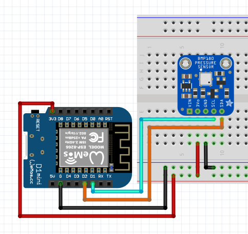

# Basics - Measure Pressure

Let's apply some pressure now. For that lets grab our BMP180, a sensor to measure **atmosferic pressure** (yes, don't smash it just yet) and then the DHT11 a temperature sensor.

## Getting the tools

For these sensors there's libraries that can help you keeping things simple and the code clean. The library for the BMP180 has a different name from the sensor, don't strange, it is made to work with a range of sensors and this is one of them, just like the library for DHT11 is made for many DHT sensors not just the DHT11. You'll come across this kind of things very often.

Go ahead and grab the **Adafruit BMP085** and **SimpleDHT** libraries from the library manager, going into *Sketch -> Include Library -> Manage Libraries* and searching for them.
Now that you've downloaded the libraries, they are available for you to use.

## For the pressure sensor:

### Before getting your hands dirty

Before you get mesurements from a sensor it is **very common** to be required to initialize the sensor in *void setup()* specially I2C sensors like the BMP180.

So all you have to do is create an instance of *Adafruit_BMP085* and make it global by writing this outside any function:



```Arduino
Adafruit_BMP085 bmp;
```

It is crucial to make it global so you can acess it no matter what function you're on, like *void setup()* or *void loop()* or any other.

## Initialize the sensor

All you need to do is call the following function on *void setup()*

```Arduino
bmp.begin()
```
## Taking Mesurements

Now you're ready to work!

These are the functions you can use along with the variable type they return. Their names are self explanatory:

```Arduino
float readTemperature(void);
int32_t readPressure(void);
int32_t readSealevelPressure(float altitude_meters = 0);
float readAltitude(float sealevelPressure = 101325); // std atmosphere
uint16_t readRawTemperature(void);
uint32_t readRawPressure(void);
```

## For the temperature sensor

Similarly to the pressure sensor you have to create an instance of *SimpleDHT11* however now we need to define a global variable to store the pin in which we will connect.


>**Please note:** You should use the version **1.2.3** of the DHT Library, not the latest one!

```Arduino
int pinDHT11 = D0;
SimpleDHT11 dht11;
```

This time you don't need to do anything on the *void setup()* but everytime you want to read from the sensor you have to call this function specifying two variables in which you'll store the measurements:

```Arduino
int temperature = 0;
int humidity = 0;
dht11.read(pinDHT11, &temperature, &humidity, NULL)
```

Then you can use those two variables.

Go ahead and make it print those values onto the **Serial Monitor** and later on in webpages... You'll get there!

Ready? Let's move!

[Main Menu](../readme.md) | [Next](./movement.md)
