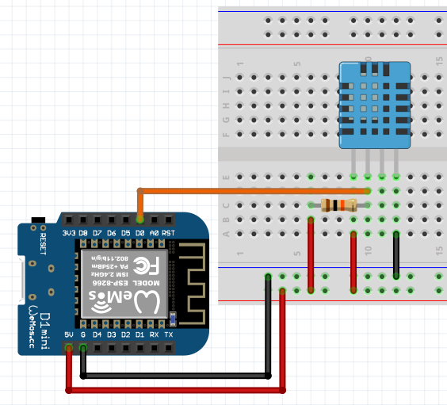

# Basics - Measure Temperature

Let's grab our DHT11 a temperature sensor!

## Getting the tools

For this sensor there's a library that can help you keeping things simple and the code clean.

Go ahead and grab the **SimpleDHT** library from the library manager, going into *Sketch -> Include Library -> Manage Libraries* and searching for it.
Now that you've downloaded the library, it is available for you to use.

## DHT11

For starters, you have to create an instance of *SimpleDHT11* and make it global by writing this outside any function

It is crucial to make it global so you can acess it no matter what function you're on, like *void setup()* or *void loop()* or any other.



```Arduino
int pinDHT11 = D0;
SimpleDHT11 dht11;
```

Everytime you want to read from the sensor you have to call this function specifying two variables in which you'll store the measurements:

```Arduino
int temperature = 0;
int humidity = 0;
dht11.read(pinDHT11, &temperature, &humidity, NULL)
```

Then you can use those two variables.

Go ahead and make it print those values onto the **Serial Monitor** and later on in webpages... You'll get there!

Ready? Let's move!

[Main Menu](../readme.md) | [Next](./movement.md)
