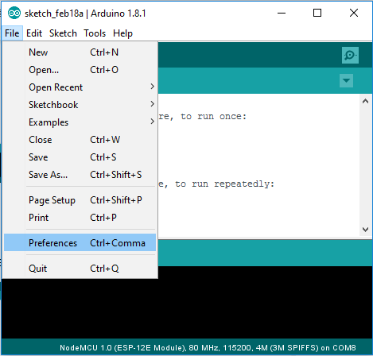

# Introduction - Setting Up

Ready to start coding? Not so fast! First we'll configure our computer.

Throughout this workshop we'll use the Arduino IDE to write and upload our code to the ESP8266 microcontroller (big word? We'll get there in a sec).

To download the Arduino IDE go to [arduino.cc](http://arduino.cc)

Then you have to add the ESP8266 to your board list so you can program it. To do that, go to File -> Preferences

And then add the following link to Additional Boards Manager URLs:

http://arduino.esp8266.com/stable/package_esp8266com_index.json

Now go to Tools -> Board -> Boards Manager and search for ESP8266. If you don't find it try restarting the Arduino IDE.

## Linux specific instructions

If you are using Linux, make sure to add your user to the 'dialout' and 'tty' groups or you won't be able to upload code.

<code>
$sudo usermod -a -G tty yourUserName

$sudo usermod -a -G dialout yourUserName
</code>

Log out and back in and you should be set.

## macOS Sierra specific instructions

As the official driver of the CH340G chip crashes the macOS kernel, a dedicated GitHub user created his own driver for the chip that is compatible with macOS Sierra.

Folow [his instructions](https://github.com/adrianmihalko/ch340g-ch34g-ch34x-mac-os-x-driver) to install the driver.

Then restart your machine and you're set!

## OSX specific instructions

Install the driver provided in [this page](https://www.wemos.cc/downloads) and restart.

[Main Menu](../readme.md) | [Next](../content/statemachines.md)