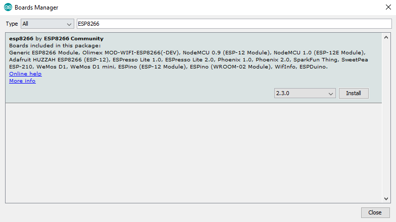

# Introduction - Setting Up

Ready to start coding? Not so fast! First we'll configure our computer.

Throughout this workshop we'll use the Arduino IDE to write and upload our code to the ESP8266 microcontroller (big word? We'll get there in a sec).

To download the Arduino IDE go to [arduino.cc](http://arduino.cc)

Then you have to add the ESP8266 to your board list so you can program it. To do that, go to File -> Preferences

And then add the following link to Additional Boards Manager URLs:

http://arduino.esp8266.com/stable/package_esp8266com_index.json

Now go to Tools -> Board -> Boards Manager and search for ESP8266

If you are using linux, make sure to add your user to the 'dialout' group or you won't be able to upload code.

Then restart Arduino IDE and you're ready to go!

[Next](../content/introduction.md)